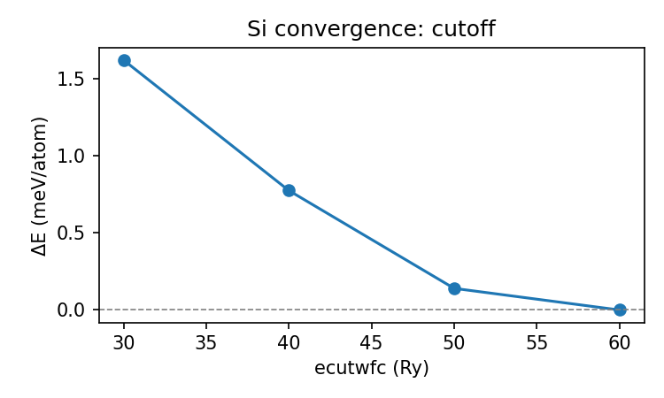
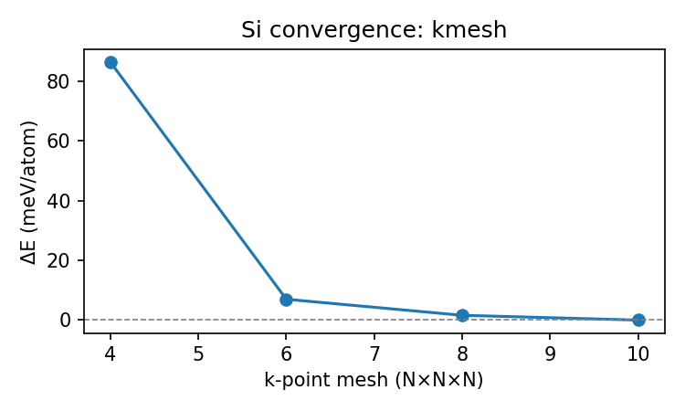

# Silicon Convergence Study (QE 7.4.1)

These runs were produced with `cases/si/convergence/run_convergence.py`, which drives `pw.x`/`bands.x` using the Si PSLibrary ultrasoft pseudopotential (`Si.pbe-n-rrkjus_psl.1.0.0.UPF`). Each run stores its raw QE outputs under `cutoff_*` or `kmesh_*` subdirectories.

## Cutoff scan (k = 8×8×8)

- `ecutwfc` values: 30, 40, 50, 60 Ry with `ecutrho = 8 × ecutwfc`.
- Results: `cutoff/cutoff.csv` (CSV) and `cutoff/cutoff.json` (machine-readable).
- ΔE quoted as meV/atom relative to the 60 Ry run; Δgap referenced to the same baseline.
- Summary (meV/atom): 30 → +1.62, 40 → +0.78, 50 → +0.14, 60 → 0.
- Band gap stabilises within 0.1 meV beyond 40 Ry.



## k-point scan (ecut = 30/240 Ry)

- Monkhorst–Pack meshes: 4×4×4, 6×6×6, 8×8×8, 10×10×10.
- Results: `kmesh/kmesh.csv`, `kmesh/kmesh.json`.
- ΔE relative to 10×10×10: 4×4×4 → 86.4 meV/atom, 6×6×6 → 7.0 meV/atom, 8×8×8 → 1.6 meV/atom, 10×10×10 → 0.
- Indirect gap converges within 0.5 meV by 8×8×8.



## Adopted production settings

- `ecutwfc = 30 Ry`, `ecutrho = 240 Ry`, in agreement with the [SSSP Efficiency 1.3.0](https://www.materialscloud.org/discover/sssp/table/efficiency) recommendation for `Si.pbe-n-rrkjus_psl.1.0.0.UPF` (dual = 8).
- SCF mesh: 8×8×8 Monkhorst–Pack.
- NSCF mesh for DOS/PDOS: 12×12×12 (denser than SCF, as per QE tutorials).
- `nbnd = 36` for NSCF/PDOS to capture states up to ~47 eV above E_F.

Re-run the scans with:

```sh
python3 cases/si/convergence/run_convergence.py
```

The script depends on `mpirun`, QE executables under `artifacts/q-e-qe-7.4.1/bin`, and Matplotlib for the ΔE plots.
